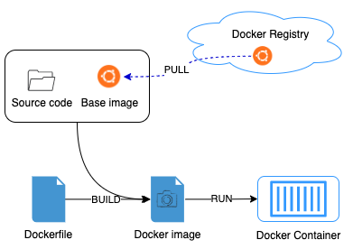

# Kubernetes usage basic learning

## Motivation

I saw many people who want to learn with Kubernetes but they don't have much time for reading a bunch of definitions to understand how it works.
Or just because many tutorials focus too much on explaining all the definitions of Kubernetes and examples aren't focused on what they exactly want, deploy a simple application from End to End

Therefore, I made this small project with the aiming to support those, who want to learn k8s but don't have much time, to have the basic mindset of how Kubernetes works and how to work with it.
In this guideline, we will cover basic knowledge of K8s with step by step examples and I hope this can help other beginners

- We won't go depth into Docker in this guideline, but some basic knowledge in Docker and dockerize will be required. You can go to [Docker get started](https://docs.docker.com/get-started/) for a quick review about docker before we can move on
- I will try to avoid as much definition as I can in this tutorials, and I will focus more on practical examples with commands and explainations at that state, so if you need to know the definition and stuff, please the link **Kubernetes documentation** above

If you want to learn fully about Kubernetes please read [Kubernetes documentation](https://kubernetes.io/docs/tutorials/)

> **Importants**:
>
>   When you go through this guideline, you may see many explanations that may not correct 100% with the definitions on the official Documentation, since the target of this project is helping people have the general/basic knowledge on K8s.
>   Therefore, I made this as simple as I can, and some of them are the simple conclusion about my experience in Kubernetes.
>
>   Please let me know if any part of this guideline have incorrect, all of contributions are appreciated to make this guideline better


<!-- vim-markdown-toc GFM -->

* [Docker - Basic knowledge before we start](#docker---basic-knowledge-before-we-start)
  * [What is Docker](#what-is-docker)
  * [Docker Requirement](#docker-requirement)
  * [Learning Resource](#learning-resource)
* [Kubernetes](#kubernetes)
  * [What is Kubernetes:](#what-is-kubernetes)
  * [Kubernetes concepts and components](#kubernetes-concepts-and-components)
* [Physical level](#physical-level)
  * [Requirement](#requirement)
  * [How to connect to Kubernetes cluster](#how-to-connect-to-kubernetes-cluster)
  * [Simple command to work with Kubernetes Cluster](#simple-command-to-work-with-kubernetes-cluster)
* [Logical level](#logical-level)
  * [Requirement](#requirement-1)
  * [Ex-1: Simple deployment sample](#ex-1-simple-deployment-sample)
  * [Ex-2: containers comunication between deployment](#ex-2-containers-comunication-between-deployment)
  * [Ex-3: Deployment with multiple Containers in a pod](#ex-3-deployment-with-multiple-containers-in-a-pod)
  * [Ex-4:](#ex-4)

<!-- vim-markdown-toc -->

## Docker - Basic knowledge before we start

If you want to learn to use Kubernetes, you must know how to work with Docker first. It's because Kubernetes will host your service/application as a Docker container from Docker image.

By that, we will need to understand how to Dockerize an application and understand to work/troubleshoot a Docker container first 

**Going back in time:**

Years ago, most software applications were big and they included many services and jobs, including serving external connections as Hub, processing logical requests as a backend, or even serving frontend pages. those software applications development used to call with name `monolithic` application.

These monolithic applications are used to run a single process with all components on a handful server, this development system can work but it's hard to scale up and have many potential harmful to the server itself or the company business.

For instance, with many components running inside one server, this is challenging for scaling up when the server cannot handle more works.
or when we have an issue with the running server, it will take time to troubleshoot and identify which components cause the issue and how can we keep the service online ASAP.
Besides, we may face many problems related to libraries installed in the server when having conflict between multiple applications deployed in the same server.
and there are still have many issues with the security or automating processes.

with the development of software development, these big monolithic legacy applications are slowly being broken down into smaller, independently running components called `microservices`. 

The microservices can understand as an architectural pattern that we have many independent applications, which play certain roles or serve a single service. 
These services communicate with each other via a well-defined interface using lightweight apis and because they are independently run, each service can be updated, deployed, and scaled to meet the demand for specific functions of an application.


The microservice replacing the old architectural (monolithic application) and resolve many problems in architecture and scaling, but with the developing of the product or expanding of business, 
the number of components requires to deploy increases time by time, and it becomes difficult to configure, manage and keep the whole system running smoothly.

However, microservices also bring other problems such as making it hard to debug and trace execution calls, because they span multiple processes and machines.
Or have more complexity on choosing the deploy components to server for not conflict on required libraries and get the high resource utilization.


With those difficult, docker come up with a high advantage in packaging source code and deploying it in an isolated environment which is not related much to the hosting machine.


### What is Docker

> " Docker is an open platform for developing, shipping, and running applications. Docker enables you to separate your applications from your infrastructure so you can deliver software quickly.
>   With Docker, you can manage your infrastructure in the same ways you manage your applications. By taking advantage of Docker’s methodologies for shipping, testing, and deploying code quickly, you can significantly reduce the delay between writing code and running it in production.

Basically, Docker is an open-source platform that we can package (or we can say "Image" in docker) our application with its whole environment need, this can be a few libraries or any filesystem of an installed operating system. 

To run your application with this image, we just need to deploy it to docker environment in the Serve, and it will be executed as Container
Or we can transfer image(s) to storage to store it for future usage or backing up (we call it's "Registry" in Docker)

With this mechanism, we can deploy to multiple servers at the same time without doing any re-configuration on hosting servers.
Or we can only restart the docker container to make it back to the original state when happing any urgent issue and impact directly to business

There are three main Docker components:

**Images** :
- Basically, a Docker image has everything needed to run a containerized application, including code, config files, environment variables, libraries, and runtimes. 
  To make a Docker image, we must have a Dockerfile that including a base image and a set of commands to copy application source code to the base image or install needed libraries

**Containers** :
- We can understand the docker container is virtualized runtime environment of a Docker image, which means we start running our application under the docker environment.
  We can have multiple containers running on one hosting server and it's completely isolated from both host and all other containers. 
  However, we also can set up container's network to a container or between containers to containers or expose ports to open the connection between the host

**Registry** :
- A Docker Registry is a place that stores your Docker images and facilitates easy sharing of those images between different users and computers.
  When you build your image, you can either run it on the computer you’ve built it on, or you can push (upload) the image to a registry and then pull (download) it on another computer and run it there.
  Certain registries are public, allowing anyone to pull images from it, while others are private, only accessible to certain people or machines.




### Docker Requirement

To follow this guideline, you must have:
- Docker installed in your machine, check [Docker install](https://docs.docker.com/engine/install/) if you don't have it


### Learning Resource

I have created a python application to demonstrate this guideline and I call it "[dummy-api](./dummy-api)".
If you want to run it directly in your local to know how it's working, please check [dummy-api Readme]('./dummy-api/README.md')

In the project, I have created a [Dockerfile](./dummy-api/Dockerfile) which contains steps to build a docker image

Then we in the next step I will show how can we dockerize this application to prepare to deploy it to Kubernetes env.
Make sure your Docker server is up and running. Now we will create a Docker image in our local machine.

1. Open terminal and go to folder [dummy-api](./dummy-api)

1. Execute command below:
    ```bash
      docker build -t dummy-api:latest .
    ```

1. When it's finished, we can check created docker image with:
    ```bash
      docker images
    ```

    You will get response like this
    ``` 
      REPOSITORY             TAG             IMAGE ID       CREATED         SIZE
      dummy-api              latest          f1060ccb9b7e   6 seconds ago   58.9MB
    ```

- In case  you want to remove the image too
```bash
  docker rmi dummy-api:latest
```

**Test running this docker image (Optional)**

Execute command below, it will run your built image as a docker container and we will able to access it

```bash
  docker run -d --name dummy-container -p 105:105 dummy-api:latest

  # Args explain
  #  -d      : The container will run in background
  #  --name  : Set the name of creating container, will random if we dont set
  #  -p      : Forward internal port of container (left) to external port of our machine (right). Cannot access to container if we dont set

```

Then you can test it by open your browser and navigate to http://localhost:105

- To view all of your docker container
    ```bash 
      docker ps -a
    ```

- To get the realtime log of the container
    ```bash
      docker logs -f dummy-container
    ```

- To run shell inside a container
    ```bash
      docker exec -it dummy-container sh   # Some container have bash shell so we can use it instead of "sh"
    ```

-  To stop the container and all of it changes content still there
    ```bash
      docker stop dummy-container
    ```

- We can start the stopped container again
    ```bash
      docker start dummy-container
    ```

- And remove it, all its contents are removed and it can’t be started again.
    ```bash
      docker rm dummy-container
    ```

> **Note**: The container loaded from your docker image, so if we stop or remove the container it will not affect to the built image.

- To push docker image to Docker Hub or your personal registries
    ```bash
      docker push dummy-api:latest
    ```

## Kubernetes

In the above session, we have a general idea about Docker and the usage of Docker or containerization in helping deploy microservice architecture.
And that was great since Docker solve most of the issues of software development, and Docker seems to have all the parts we need to build, deploy an application. 
But why do we still need Kubernetes?

**Going back in time**:

With the evolution of software development:


- **Traditional deployment**:

    Applications ran directly on the physical servers and as mentioned in the above session, we will have many potential issues with the server, 
    from libraries conflict between applications to one application can damage all other applications due to crashes or hack. 

    Besides, the resource consumption between application isn't defined clearly, which lead to one application can use most of the server resource and all other application would crash or underperforming. 

    And to avoid those issues, each application must run on a different server, but this solution isn't utilized hardware resources and it causes organizations more money to maintain those servers.


- **Virtualized deployment**:
    
    For archiving the goals of isolated application on each server but still reducing the maintenace cost, we applied virtualization.
    
    With virtualization, we can split a physical server into small isolated Virtual Machines (VMs). With this approach, we can actively control the resource usage of each application and security
    
    However, since each VM is a full machine running all the components, including OS system, libraries, etc., this makes jobs for provisioning, managing and backing up much more difficult and required more skills to do it


- **Containers deployment**:
  
    Follow with the VMs, Containers deployment is a new evolution with the concept to separate software deployment with hardware.

    Applications will be isolated in an individual areas with necessary components/libraries but not including the Operating System (OS), which will share between containers in the same server.

    However, the usage of containerization still related much to manual works but with the growth of the product or expanding of the business domain, Dev team always have to deal with other stuff:
    - Manage deployed containers in server to ensure no downtime, this will include monitoring and failure-handling system
    - We cannot deploy manually everything, those works must be automated and acknowledged when the deployment isn't success
    - Managing resources/servers to keep server always has capable to load new deployment and recycle logs to avoid disk run out.

That's how Kubernetes comes to the rescue! Kubernetes provides you with a framework to run distributed systems resiliently.

It takes care of scaling and failover for your application, provides deployment patterns, and more. For example, Kubernetes can easily manage a canary deployment for your system.

### What is Kubernetes:

> " Kubernetes is a portable, extensible, open-source platform for managing containerized workloads and services, that facilitates both declarative configuration and automation. It has a large, rapidly growing ecosystem. Kubernetes services, support, and tools are widely available.

In a simple understanding, Kubernetes (also known as k8s) is an open-source container orchestration platform that automates many of the manual processes involved in deploying, managing, and scaling containerized applications.

Kubernetes can speed up, automates the development process by making it easy with configuration template in Yaml format, with simple defined components and can load it directly to the cluster for deployment.
And it also provides self-healing for applications with features to detect and restart services when container crashes.

With the benefits of Kubernetes, any developer can package up applications and deploy them on Kubernetes with basic Docker knowledge.
And the role of Ops will shift from supervising individual applications to managing the entire Kubernetes cluster

### Kubernetes concepts and components

So the simple definition that describes Kubernetes and its functionality quite simple.
However, It's a challenge to understand the concept and roles of each component in Kubernetes.

To make this guideline simple and help you with a general overview of Kubernetes, I will split the concept of Kubernetes into 2 levels, physical and logical levels.

- In physical level, we have definitions related to hardware components of Kubernetes, and how we can connect/manage Kubernetes

- In logical level, we will learn how to deploy an application to Kubernetes and also go through some basic components for deploying an application to Kubernetes.

## Physical level

Kubernetes is not about a single server hosting a management system, it's a group of many servers (at least 2 servers) connected into a cluster.
In Kubernetes cluster, all connected servers will be a "node" of the cluster and a node can be a virtual or physical server, depending on the cluster

Node(s) in Kubernetes will have 2 types, Master and worker.

- **Master Node**: Usually only one server and it will be the controller of the entire cluster.

    In another understand, this looks like a virtual Sys Admin, who will watch your system 24/7 and do all the action needed to keep the cluster running

- **Worker Node(s)**: Is the group of servers to host your running applications (containers)


> Note: In a learning or resource-limited environment, you might have only one node and it will have both roles as Master and Worker

### Requirement

To follow this guideline, you must have:
- Docker installed in your machine, check [Docker install](https://docs.docker.com/engine/install/) if you don't have it

- Docker Desktop with Kubernetes activated or Minikube
  - Docker Desktop: Read [Docker Deskop - Kubernetes](https://docs.docker.com/desktop/kubernetes/) for how to enable K8s
  - Minikube: If you don't have kubernetes in your Docker Desktop, then follow [Minikube](https://github.com/kubernetes/minikube) to install it.

- kubectl command which will use most of the time to work with Kubernetes, check [Kubernetes install tools](https://kubernetes.io/docs/tasks/tools/)

### How to connect to Kubernetes cluster

To connect to a Kubernetes cluster, we must have 2 things, a kubeconfig file and Kubectl (CLI)

- **kubectl**:

    Is a command line interface (CLI) to help us interact with Kubernetes from managing resources to setup and deploy your application. 

    We can install the Kubectl command in [Kubernetes install tools](https://kubernetes.io/docs/tasks/tools/)

- **Kubeconfig**:

    Can understand as the key to access to the Kubernetes cluster, this file contains information and credential of Kubernetes cluster.

    The syntax of Kubeconfig file should similar to this:

    ```yaml
    apiVersion: v1
    clusters:
    - cluster:
        certificate-authority-data: ... # Certificate of the cluster, this will different for each individual
        server: http://kubernetes.docker.internal:6443       # Cluster url
      name: docker-desktop
    contexts:
    - context:
        cluster: docker-desktop
        user: docker-desktop
      name: docker-desktop
    current-context: docker-desktop
    kind: Config
    preferences: {}
    users:
    - name: docker-desktop
      user:
        client-certificate: ...    # Client cert to authority with Kubernetes
        client-key: ...            # Client key to authority with Kubernetes
    ```

By default kubectl will expect kubeconfig, represented as a file named `config` to be present in the `$HOME/.kube` directory.
Then if we want to do anything with the cluster, just type down the command
```bash
  kubectl cluster-info
```

We also can specify other kubeconfig files by setting the KUBECONFIG environment variable 
```bash
  export KUBECONFIG=/path/to/my/kubeconfig
  kubectl cluster-info
```
Or by setting the --kubeconfig flag.
```bash
  kubectl cluster-info --kubeconfig /path/to/my/kubeconfig
```

### Simple command to work with Kubernetes Cluster

For the basic, we have serveral command to work with k8s cluster in "physical" way

- To get the cluster infomation
  ```bash
  $ kubectl cluster-info

  # Sample response
  Kubernetes control plane is running at https://kubernetes.docker.internal:6443
  KubeDNS is running at https://kubernetes.docker.internal:6443/api/v1/namespaces/kube-system/services/kube-dns:dns/proxy
  ```

- Check cluster status
  ```bash
  $ kubectl get cs

  # Sample Response
  NAME                 STATUS    MESSAGE             ERROR
  scheduler            Healthy   ok
  controller-manager   Healthy   ok
  etcd-0               Healthy   {"health":"true"}
  ```

- To get all nodes of the cluster
  ```bash
  $ kubectl get nodes --show-labels

  NAME             STATUS   ROLES    AGE    VERSION   LABELS
  docker-desktop   Ready    master   233d   v1.19.7   beta.kubernetes.io/arch=arm64,beta.kubernetes.io/os=linux,kubernetes.io/arch=arm64,kubernetes.io/hostname=docker-desktop,kubernetes.io/os=linux,node-role.kubernetes.io/master=
  ```

## Logical level

In logical way, kubernetes come up with lots of new definition and components.
For each components it will have a specific role to support deploying, managing containers (applications).

### Requirement

To follow this guideline, you must have:
- Docker installed in your machine, check [Docker install](https://docs.docker.com/engine/install/) if you don't have it

- Docker Desktop with Kubernetes activated or Minikube
  - Docker Desktop: Read [Docker Deskop - Kubernetes](https://docs.docker.com/desktop/kubernetes/) for how to enable K8s
  - Minikube: If you don't have kubernetes in your Docker Desktop, then follow [Minikube](https://github.com/kubernetes/minikube) to install it.

- kubectl command which will use most of the time to work with Kubernetes, check [Kubernetes install tools](https://kubernetes.io/docs/tasks/tools/)


### Ex-1: Simple deployment sample

### Ex-2: containers comunication between deployment

### Ex-3: Deployment with multiple Containers in a pod

### Ex-4:

